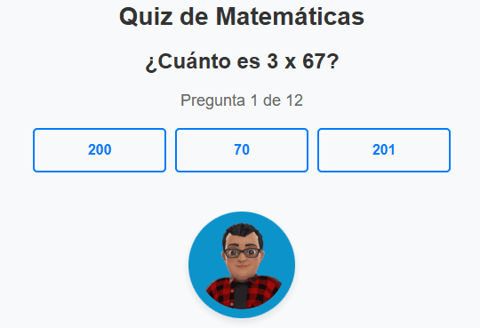

# Sistema Interactivo de Evaluación Matemática

Esta práctica se enfoca en la creación de un sistema de cuestionario interactivo de matemáticas. Utilizando PHP para la lógica del servidor y la gestión de sesiones, HTML para la estructura de la página, y CSS para el diseño y estilo visual, se ha desarrollado una aplicación web que ofrece una experiencia de usuario atractiva y educativa.

  

Las preguntas se generan de manera aleatoria y se almacenan en una estructura de datos en PHP.

Cada pregunta incluye opciones de respuesta, de las cuales solo una es correcta y dos son trampas.

Al finalizar todas las preguntas, el sistema muestra el total de respuestas correctas.

Opción para reiniciar el cuestionario y volver a intentar responder todas las preguntas.

Esta práctica demuestra la capacidad de integrar PHP, HTML y CSS para desarrollar una aplicación web interactiva que ofrece un cuestionario de matemáticas. El sistema maneja dinámicamente la generación de preguntas, la captura de respuestas y la retroalimentación al usuario, presentando una interfaz intuitiva y atractiva.

**Consulta la versión preliminar de la practica aquí:** [https://practica_03.com](https://www.alejandrovillegas.dev/projects/practice-03/index.php)

# 📌 Información de la Practica

Esta practica ha sido desarrollado como parte del portafolio de soluciones tecnológicas, con el objetivo de ofrecer una herramienta eficiente y funcional para usuarios autodidactas interesados en la gestión y desarrollo de proyectos web.

- **Área**: Desarrollo de Practicas Web

- **Usuario Final**: TecNM

- **Fecha de Desarrollo**: 15 de marzo de 2018

- **Portafolio de Proyectos**: [www.alejandrovillegas.dev](https://www.alejandrovillegas.dev)

## 🔧 Guía de Instalación y Configuración de la Practica

Siga los pasos según el entorno de desarrollo que esté utilizando:

1. Descargue y descomprima el archivo de la practica en su sistema local.

La practica ahora está funcionando en su entorno local. 🎉
